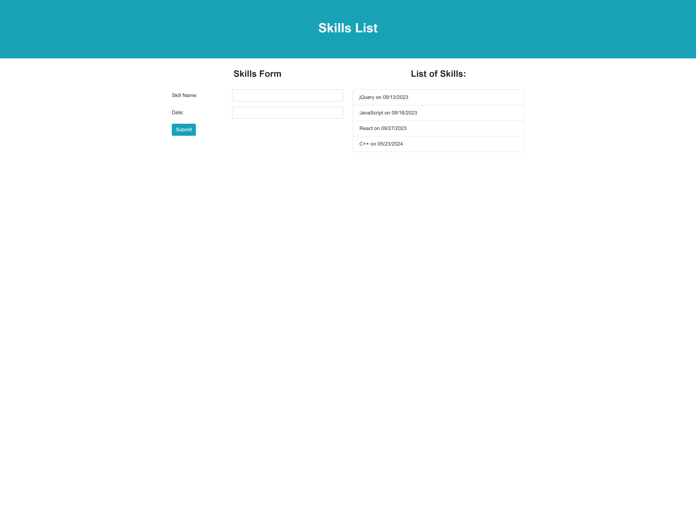

# JQuery-Widget-

## Description
In this project I am building a skills list page using HTML, CCS, JavaScript, and JQuery. A user should be able to type in skill name, select a month, date, year and submit this information to the page. The purpose behind this project is to demostrate and practice my JQuery skills. 

## Usuage
https://eugeneisingizwe.github.io/JQuery-Widget-/

## Questions 

If you have any questions about this projects, please contact me directly at eugeneisingizwe95@hotmail.com. You can view more of my projects at https://github.com/eugeneisingizwe.